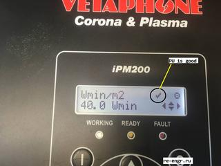

## CAN
125Kbps  

`201	  4	06 01 05 00`  
0x0105 - версия ПО в PU (1.05)

`700	  8	01 0A 28 15 02 00 1D 02`  
0x1528 - 5416 - VAC (LCD)  
0x021D - 541 - VDC (LCD) 
0x0002 - 2 - IAC (LCD)  

`502	  8	10 00 00 00 00 00 00 00`  
0x10 - состояние реле (выходных?)

## PU (power unit)
Емкости заряжаются через резисторы до определенного уровня. Гаснет красный СД. В версии 1.05 загорается зеленый СД и замыкается шунтирующее реле. 
В версии 1.11 этого не происходит, команда на замыкание реле приходит из панели. (зеленый СД так же не загорается)  
Панель с версией ПО 5.27 не работает с PU версией 1.11.  

## MENU
При корректной инициализации PU, на инжикаторе в верхней строке отображается "галочка".   

## FAN
В выключенном состоянии на выходе TG имеется напряжение 24В (подтяжка через СД оптрона и резистор). При работе вент. амплитуда импульсов TG достигает максимум 12В (какое-то внутреннее ограничение??). По этой причине оптрон, через который импульсы TG идут на PU MCU, постоянно открыт. Что бы он закрывался, нужно что бы импульсы имели величину 24В. Так что PU MCU получает только два состояния: вентилятор работает или не работает. Попытался подать импульсы на вход MCU от внешнего генератора, но никаких изменений не заметил (по CAN шине). Вероятно так и задумывалось. 

## Firmware
В PU установлен dsPIC30F4011. Открыт. Поддерживается Pickit 3.  
Прошивка `vetaphone_ipm200_10_pu_v1.05.hex` атоматически замыкает реле при достижении нужного напряжения на конденсаторах.  Если напряжение ниже, загорается красный СД, если в норме - красный гаснет, загорается зеленый.  
Прошивка `vetaphone_ipm200_10_pu_v1.11.hex` гасит красный СД и ждет команды от панели (CU).

